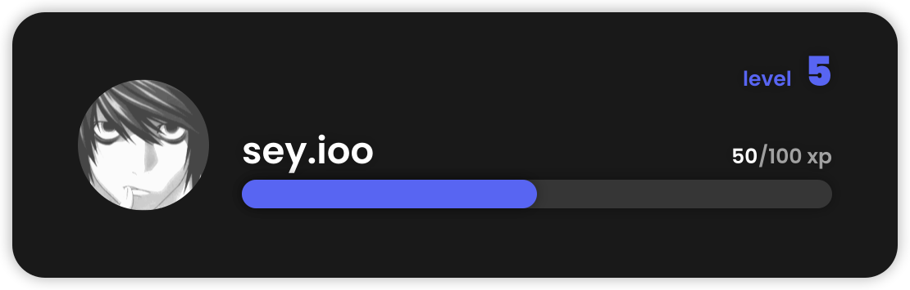

<div align="center"><h1>Discord-Sey</h1></div>
An easy multi-tool package for Discord.JS v13 !
The package is not finished, if you find a bug, contact sey.#4485 !

# Summary
- [Requirements](#requirements)
- [Installation](#installation)
- [Pagination](#pagination)
- [RankCard](#rankcard)

# Requirements
- [Node](https://nodejs.org/en/) - 20.16.0
- [NPM](https://www.npmjs.com/) - 10.8.1

# Installation
To install the package, execute this command in the terminal:
```bash
npm install discord-sey
```

# Pagination
Create a customizable embeds pagination !

## Quick Start
You just have to import the Pagination class as well:
```js
// Import the Pagination class
const { Pagination } = require('discord-sey');
```

### Example
```js
// Import the Pagination class
const { Pagination } = require('discord-sey');

// Register the messageCreate event
client.on('messageCreate', (message) => {
    const embeds = [
        new EmbedBuilder() // The first page
        .setTitle('Page 1'),
        new EmbedBuilder() // The second page
        .setTitle('Page 2')
    ];
    
    const pages = new Pagination()
    .setPages(embeds) // Set the pages (required)
    .addPage(new EmbedBuilder().setTitle('Page 3')) // Add one page (optional)
    .addPages([new EmbedBuilder().setTitle('Page 4'), new EmbedBuilder().setTitle('Page 5')]) // Add more pages (optional)
    .setEmojis(['⏪', '⏩']) // Set the previous and next buttons (optional, default: ['⬅️', '➡️'])
    .setTimeout(60000) // One minute timeout (optional, default: null)
    .addTimeout(60000) // Add timeout (optional)
    .setStyle('SECONDARY') // Set the buttons style (optional, default: "PRIMARY")
    .start(message); // Create the pagination (required)

    if (message.content.startsWith('!previous')) pages.previous(); // Pagination by commands (optional)

    if (message.content.startsWith('!next')) pages.next(); // Pagination by commands (optional)

    if (message.content.startsWith('!end')) pages.end(); // End the pagination (optional)

    if (message.content.startsWith('!delete')) pages.delete(); // Delete the pagination (optional)
});

// You also can do the same thing with interactionCreate event
client.on('interactionCreate', (interaction) => {
    const embeds = [
        new EmbedBuilder() // The first page
        .setTitle('Page 1'),
        new EmbedBuilder() // The second page
        .setTitle('Page 2')
    ];
    
    const pages = new Pagination()
    .setPages(embeds) // Set the pages (required)
    .addPage(new EmbedBuilder().setTitle('Page 3')) // Add one page (optional)
    .addPages([new EmbedBuilder().setTitle('Page 4'), new EmbedBuilder().setTitle('Page 5')]) // Add more pages (optional)
    .setEmojis(['⏪', '⏩']) // Set the previous and next buttons (optional, default: ['⬅️', '➡️'])
    .setTimeout(60000) // One minute timeout (optional, default: null)
    .addTimeout(60000) // Add timeout (optional)
    .setStyle('SECONDARY') // Set the buttons style (optional, default: "PRIMARY")
    .start(interaction); // Create the pagination (required)
});

// Log-in the Client
client.login('TOKEN');
```

# RankCard
Create a customizable rank card !

## Quick Start
You just have to import the RankCard class as well:
```js
// Import the RankCard class
const { RankCard } = require('discord-sey');
```

### Example
```js
// Import the RankCard class
const { RankCard } = require('discord-sey');

// Register the ready event
client.on('messageCreate', async (message) => {
    const card = new RankCard()
    .setTag(message.author.tag) // Set the tag (required)
    .setAvatar(message.author.displatAvatarURL({ format: 'png' })) // Set the avatar (required)
    .setLevel(5) // Set the level (required)
    .setCurrentXp(50) // Set the current xp (required)
    .setRequiredXp(100) // Set the required xp (required)
    .setColor('#5865F2') // Set the color (optional, default: "#5865F2")
    .build(); // Create the rank card (required)

    const data = await card.build();
    const image = new AttachmentBuilder(buffer)
    .setName('rankcard.png');

    message.channel.send({
        files: [image]
    });
});

// Log-in the Client
client.login('TOKEN');
```

### Result
